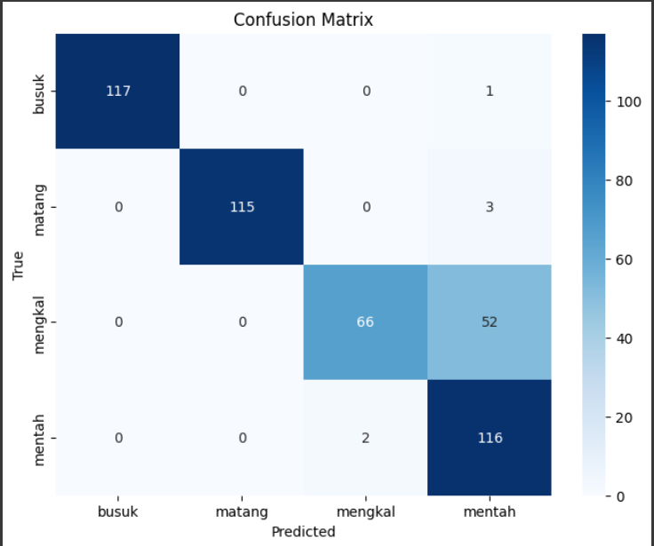

# Computer Vision Project Progress Report (25%)

## Project Name
*Aplikasi Deteksi Kematangan Buah Sawit*

## Student Name
*Surya Pradipa Warren*

## Course/Institution
*Computer Vision / Politeknik Caltex Riau*

---

## 📌 Latar Belakang
Pada proses produksi minyak sawit, salah satu aspek krusial yang harus diperhatikan adalah tingkat kematangan buah sawit. Tingkat kematangan ini sangat penting dalam menentukan kualitas dan kuantitas minyak yang dihasilkan. Buah sawit yang dipanen pada tingkat kematangan yang tepat akan menghasilkan minyak dengan rendemen tinggi dan kualitas terbaik.

---

## 🎯 Tujuan
- ### Deteksi Kematangan
  Mendeteksi tingkat kematangan buah sawit yang mana terdapat beberapa tingkat yaitu mentah, mengkal, matang dan busuk
- ### Meningkatkan efesiensi
  Dengan adanya aplikasi ini dapat meningkatkan efisiensi dari penyortiran kematangan

---

## ✅ Manfaat
- Membantu petani dalam mendeteksi tingkat kematangan buah sawit secara cepat dan tepat.
- 

## 📁 Dataset
- Dataset dikumpulkan secara manual melalui google
- Total dataset seanyak 2.360 gambar dengan pembagian tiap kelas sebanyak 590

---

## 🚀 Hasil 
- ### Grafik akurasi dan loss model
  
- ### Confusion Matrix
  
- ### Aplikasi
  

  
  
  

  

  
  

---

## 📈 Progress Saat Ini
- Progres Proyek: *25%*
- Model CNN telah mulai dikembangkan dan diuji dengan dataset awal dari Kaggle.
- Proses preprocessing dan augmentasi gambar sedang dilakukan.
